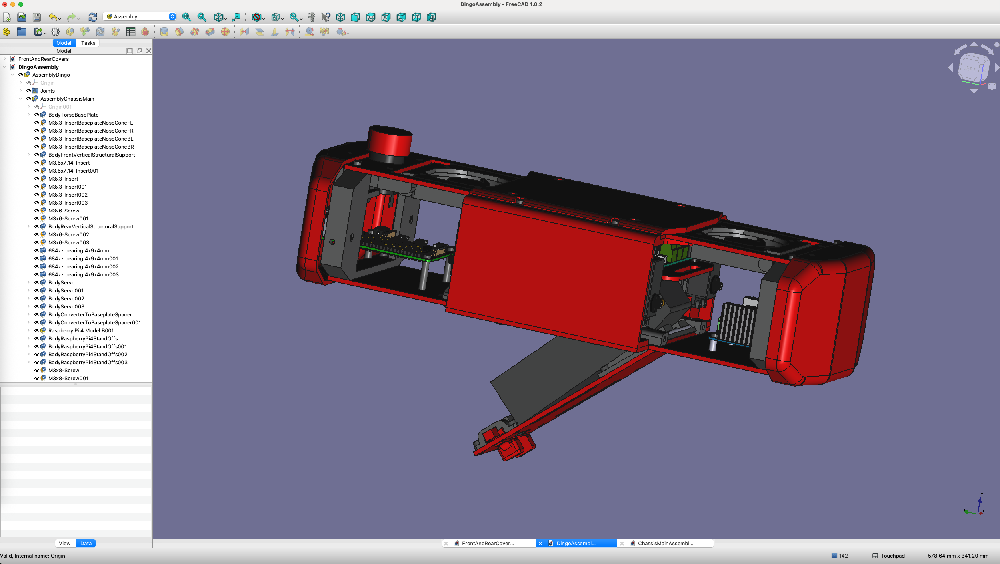

# FreeCAD-Dingo-Quadruped-
A repository containing the FreeCAD CAD files for the robot, firmware for microcontrollers, and code for the robot

This is a version of the original design located [here](https://github.com/Yerbert/DingoQuadruped) and is intended to recreate the core functionality utilzing all open source tools.

# Directory Structure
The following describes the diretory structure. Note: The FreeCAD 1.0 Assembly workbench is used for putting all parts and sub-assemblies together into a single document.

-  BOM - Will hold a generated bill of materials once the assembly is completed.
-  DingoAssembly.FCStd the parent assembly to open containing the fully assembled robot.
-  EDA - Will contain KiCAD files for PCBs
-  LegParts - Contains all the CAD files that make up the legs of the robot.
-  OffTheShelfComponents - Contains standar parts that are ordered but used to positiong items in the custom parts. Some are step file format and others were modeled using FreeCAD.
-  Stand - Will contain the stand used for testing the robot.
-  SubAssemblies - Contains various SubAssemblies that are part of the parent assembly.
  -  BatteryTray - The SubAssembly for the battery holder and related parts.
  -  BL_Leg - The SubAssembly for the back left leg.
  -  BR_Leg - The SubAssembly for the back right leg.
  -  Chassis_Main - The SubAssembly that contains all of the parts of the main chassis of the robot.
  -  Fasteners - Contains standard screws, nuts, bolts, and heat inserts used from the fasteners workbench.
  -  FL_Leg - The SubAssembly for the front left leg.
  -  FR_Leg - The SubAssembly for the front right leg.
  -  Middle_Platform - The SubAssembly that sits in the center of the robot and houses various electronics components.